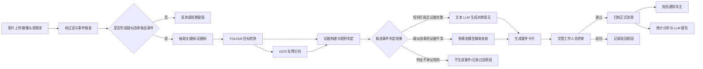

# 设计目标、技术架构与角色权限

来源：[docs/系统设计方案.md](../系统设计方案.md)

AI 读取范围：系统目标、总体处理流水线、推荐技术栈、服务划分、核心角色和权限原则。

---

## 1. 设计目标

本系统面向“市民随手拍”和“摄像头抓拍”两类主要违章图片来源，构建一条统一的智能案件处理流水线：

设计优先级：

1. 严格服务于核心流程：图片接入、YOLOv8 识别、AI 初审、人工终审、归档、通知、统计分析。
2. 参考 `docs/基于AI的交通违章智能管理平台.md`，但不照搬全部扩展功能。
3. MVP 以课程/毕设可落地为目标，保留后续生产化扩展点。

## 2. 技术架构

### 2.1 推荐技术栈

| 层级 | 技术 |
| --- | --- |
| 前端 | Vue 3、TypeScript、Pinia、Vue Router、Element Plus 或 Naive UI |
| 后端 API | FastAPI、Pydantic、SQLAlchemy |
| 数据库 | MySQL 8.x |
| 缓存/任务队列 | Redis + Celery/RQ |
| AI 推理 | YOLOv8、OCR、违章规则判定、LLM 文本模型、多模态模型 |
| 文件存储 | 本地 MinIO 或对象存储抽象层 |
| 通知 | 短信服务商适配器 `SmsProvider` |
| 鉴权 | JWT + RBAC |

### 2.2 服务划分

| 服务/模块 | 职责 |
| --- | --- |
| Web 前端 | 市民端、审核工作台、统计分析台、系统管理页 |
| API 服务 | 登录鉴权、案件查询、审核、违章归档、统计接口 |
| AI 服务 | YOLOv8 目标检测、OCR、违章规则判定、多模态复核、LLM 初审、分析报告 |
| 异步任务服务 | 图片识别、AI 初审、短信发送、统计报告生成 |
| 数据服务 | 统一读写 MySQL，管理案件、违章、车辆、通知、日志 |
| 外部接入层 | 摄像头 API Key 鉴权、抓拍图片接收、接入日志 |

## 3. 核心角色与权限

| 角色 | 主要能力 |
| --- | --- |
| 市民用户 | 上传随手拍、查看举报状态、查看本人车辆违章 |
| 交管工作人员 | 查看案件卡片、人工终审、补录车牌、驳回案件、查询违章 |
| 超级管理员 | 用户权限、摄像头密钥、违章规则、短信模板、系统日志 |
| 摄像头设备 | 通过 API Key 上传抓拍图片和结构化元数据 |

权限原则：

- 市民只能访问本人数据。
- 摄像头只能调用接入接口，不能查询业务数据。
- 工作人员可以审核案件，但不能修改 AI 原始识别结果，只能追加人工结论。
- 正式违章必须由人工终审通过后生成。

