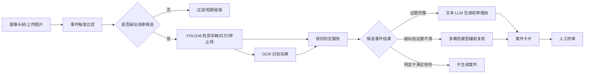
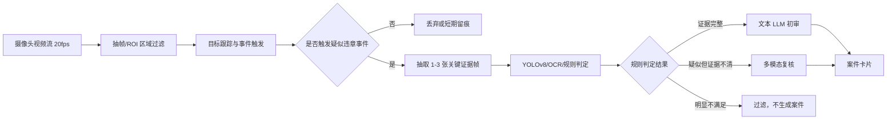

# 业务状态流与 AI 职责边界

来源：[docs/系统设计方案.md](../系统设计方案.md)

AI 读取范围：案件状态、AI 初审结论、YOLOv8/OCR/规则判定/LLM/多模态模型的职责边界，以及摄像头高频帧候选事件机制。

---

## 4. 业务状态流

### 4.1 案件状态

| 状态 | 含义 |
| --- | --- |
| `uploaded` | 图片已接入，等待识别 |
| `detecting` | YOLOv8 正在提取车辆、车牌、信号灯、车道线等视觉要素 |
| `ai_reviewing` | LLM 或多模态模型正在初审 |
| `pending_human_review` | 已生成案件卡片，等待人工终审 |
| `approved` | 人工审核通过 |
| `rejected` | 人工审核驳回 |
| `archived` | 已生成正式违章记录 |
| `notified` | 已向车主发送通知 |

### 4.2 AI 初审结论

| 结论 | 含义 |
| --- | --- |
| `suggest_approve` | AI 建议通过，证据较充分 |
| `need_review` | AI 标记存疑，需要重点人工复核 |
| `suggest_reject` | AI 建议驳回，证据不足或规则不匹配 |

### 4.3 YOLOv8 与 LLM 的职责边界

重要修正：YOLOv8 输出的 `confidence` 是目标检测置信度，例如“这个框是不是车”“这个框是不是人”“这个框是不是车牌”。它不能直接表示“是否违章”的置信度。因此系统不能用 YOLOv8 目标置信度直接判断违章是否成立。

YOLOv8 负责“识别画面中的视觉要素”：

- 识别车辆、行人、车牌区域、红绿灯、停止线、车道线、禁停标识等目标。
- 输出目标类别、目标检测置信度、检测框、标注图。
- 记录模型版本，便于后续追溯。
- 目标检测置信度只用于判断“目标检测质量”，不作为违章成立依据。

OCR 负责“车牌是什么”：

- 从车牌框中识别车牌号码。
- 识别失败时允许人工补录。

违章规则判定服务负责“是否满足违章规则”：

- 读取 YOLOv8 视觉要素、OCR 车牌、时间、地点、车速、路口信号状态、道路规则。
- 根据规则计算空间关系和业务条件，例如车辆是否越过停止线、红灯状态是否存在、车辆是否位于禁停区域、车速是否超过限速。
- 输出违章类型候选、规则匹配结果、证据完整度、缺失证据列表。
- 规则判定结果是 AI 初审分流的主要依据。

LLM 负责“如何解释和初审”：

- 读取 YOLOv8/OCR 输出、规则判定结果、时间、地点、车速、道路规则。
- 生成初审结论、理由、证据缺口和风险提示。
- 将结构化证据解释成工作人员容易理解的案件意见。
- 不直接决定处罚，不直接写入正式违章。

多模态模型只在必要时介入：

- 多模态模型不处理普通非违章帧，也不处理已经明显不满足规则的帧。
- 只有当系统已经形成“疑似违章候选事件”，但规则判定所需证据不完整、空间关系不清、检测框异常、图片场景复杂时，才读取原图和 YOLOv8 结构化结果进行辅助复核。
- 输出给工作人员参考，仍不替代人工终审。

AI 初审分流条件：

| 分流依据 | 处理方式 |
| --- | --- |
| 规则匹配、证据完整、关键视觉要素检测稳定 | 由文本 LLM 生成初审意见后进入人工终审 |
| 已形成疑似违章候选事件，但证据缺失、空间关系不清或图片复杂 | 调用多模态模型结合原图和结构化结果复核 |
| 未形成候选事件，或明显不满足违章规则 | 不调用 LLM，不生成案件卡片，只记录过滤原因或短期留痕 |

这里的“放行”指放行到人工终审队列，不是自动归档或自动处罚。

### 4.4 YOLOv8 与 AI 初审的结合方式

YOLOv8 本身也是 AI 模型，但它在本系统中承担的是“视觉证据提取器”角色，不直接承担“违章裁判”角色。系统把 YOLOv8 与 LLM/多模态模型结合的方式分为三步：

1. YOLOv8 将图片转成结构化视觉要素。

   例如输出车辆框、车牌框、红灯框、停止线框、车道线框、禁停标志框、行人框等。这里的 `confidence` 只表示“目标检测是否可靠”，例如“这个框像不像车辆”。

2. 规则判定服务把视觉要素转成违章证据。

   规则服务根据几何关系、时间地点、车速、道路规则等信息判断是否具备违章证据。例如“红灯存在 + 停止线存在 + 车辆框位置越过停止线”，才形成“疑似闯红灯”的证据链。

3. LLM 或多模态模型生成初审意见。

如果规则判定证据完整，文本 LLM 根据结构化证据生成初审结论、理由和风险提示。如果候选事件疑似违章但证据不完整或空间关系不清，多模态模型读取原图、标注图和结构化结果进行辅助复核，再输出给工作人员参考。普通非违章帧不会进入多模态复核。

示例：闯红灯案件的结合链路如下。

因此，系统中的判断依据不是单个 YOLOv8 置信度，而是：

- 目标检测结果是否能提供关键视觉要素。
- 规则判定是否能形成完整证据链。
- LLM 是否能基于证据链给出清晰、可解释、可复核的初审意见。
- 最终是否由工作人员终审确认。

### 4.5 摄像头高频帧处理策略

摄像头如果每秒产生 20 张图片，系统不能对每一帧都调用 YOLOv8、LLM 或多模态模型。正确做法是先把视频流压缩成少量“候选事件”。

处理原则：

- 原始帧不是案件，只有满足触发条件后才生成候选事件。
- 未触发候选事件的普通帧直接丢弃，或只做短期留痕，不进入案件库。
- 明显不符合违章规则的候选事件不调用 LLM，也不生成案件卡片。
- 多模态模型只处理少量“疑似违章但证据不清”的候选事件。

摄像头处理链路：

候选事件触发示例：

- 闯红灯：车辆轨迹接近或越过停止线，且当前信号灯状态为红灯。
- 违停：车辆在禁停区域内连续静止超过配置时长。
- 压线：车辆轨迹与实线区域发生重叠。
- 超速：摄像头上传车速超过路段限速。

这样设计后，20fps 摄像头不会产生 20 个 AI 调用。系统只对少量候选事件做后续识别和初审，多模态模型只作为疑难候选的辅助复核能力。

### 4.6 疑似违章候选事件判断机制

“疑似违章候选事件”不是正式案件，也不是 LLM 判断结果，而是系统在进入完整 AI 初审前做的一次低成本粗筛。它的目标是从大量图片或视频帧中筛出少量“值得进一步识别和审核”的片段。

不同来源的候选事件判断方式不同：

| 来源 | 候选事件判断方式 |
| --- | --- |
| 市民随手拍 | 用户主动上传举报，默认形成候选事件；系统只做图片质量、重复举报、格式和基础信息校验 |
| 摄像头抓拍接口 | 摄像头或边缘设备已经触发抓拍，上传的就是候选事件；系统校验设备、时间、地点、车速等元数据 |
| 摄像头视频流 | 系统通过抽帧、ROI 区域、目标跟踪、虚拟线圈、速度/信号灯元数据等触发候选事件 |

视频流下的候选事件触发器：

1. 抽帧：例如从 20fps 中按配置抽取 2-5fps 做粗筛，不直接处理每一帧。
2. ROI 区域：只关注停止线、禁停区、车道线、斑马线等重点区域。
3. 目标跟踪：跟踪同一辆车在多帧中的位置变化，而不是把每一帧当成独立图片。
4. 规则触发：当车辆轨迹和道路规则出现疑似冲突时，生成候选事件。
5. 关键帧抽取：每个候选事件只保留 1-3 张关键证据帧，例如越线前、越线时、越线后。

典型触发条件：

| 违章类型 | 候选事件触发条件 |
| --- | --- |
| 闯红灯 | 信号灯为红灯，车辆轨迹从停止线前移动到停止线后 |
| 压线 | 车辆轨迹或车辆框与实线 ROI 持续重叠 |
| 违停 | 车辆在禁停区域内低速或静止超过配置时长 |
| 逆行 | 车辆轨迹方向与车道规定方向相反，并持续多帧 |
| 超速 | 摄像头测速值超过该路段限速 |
| 占用应急车道/公交车道 | 车辆位于特定车道 ROI 内，且车辆类型或时间规则不满足通行条件 |

候选事件只说明“可能存在违章，需要进一步处理”。后续仍需 YOLOv8/OCR 提取证据、规则判定服务形成证据链、LLM 生成初审意见，最后由工作人员终审。

